# Credit Risk Analysis

## Overview of Analysis
In this activity, we were given a dataset (LoanStats_2019Q1.csv) that included data from Loan Applications. We were to analyze the data in Python using two oversampling models, one under-sampling model and two ensemble classifiers to predict the  credit risk for any given applicant of the population.
- The oversampling was accomplished by using the **_Naive Random_** and **_SMOTE (Synthetic Minority Over-sampling Technique)_** oversampling methods. In the case of random oversampling, data is randomly selected and added to the training set of the minority class until the majority and minority classes are balanced. While the SMOTE method adds samples to the minority class by the methods of interpolation.
- The undersampling analysis was performed using a **_Cluster Centroids_** method. In this method the majority class reduced by the creation of clusters of data. The centroids the clusters are then used as the sampling points in the analysis.
- **_SMOTEENN (Synthetic Minority Over-sampling Technique and Edited Nearest Neighbor)_** method was used to perform the combination (over and under) sampling. The method uses the over-sampling as described in the SMOTE method and an under-sampling technique called Edited Nearest Neighbors which uses an algorithm to drop samples by their proximity to defined classes.
- Lastly, **_Balanced Random Forest Classifier_** and **_Easy Ensemble Classifier_** models were used to analyze and compare the effectiveness of the two methods. The Random Forest Classifier uses decisions based on random sampling of the feature where as the Easy Ensemble Classifier uses an ensemble of AdaBoost learners to arrive at a balance in the samples by random under-sampling.

All models were analyzed using the Balanced Accuracy Scores, Confusion Matrices and Imbalanced Classification Reports.

**Balanced Accuracy Score:** The balance accuracy score is calculated using the average of two metrics Sensitivity and Specificity. Sensitivity tracks the True Positivity Rate, the percent of positive cases the model is able to detect and Specificity the True Negative Rate the percentage of negative cases the model is able to detect. The closer the balanced accuracy score is to 1.0, the better the model is able to correctly classify the observations

**Confusion Matrix:** A confusion matrix is used specially in supervised machine learning to display the performance of an algorithm. The figure below shows an example of a confusion matrix.

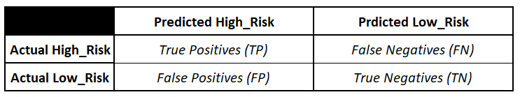

**Imbalanced Classification Report:** A classification report is a tool used in evaluating the performance of your model. The evaluation calculates a Precision, Recall (also known as Sensitivity) and the F1 Score. The closer the F1 Score is to 1.0, the better the expected performance of the model.

## Results
- **Naive Random OverSampler Model**
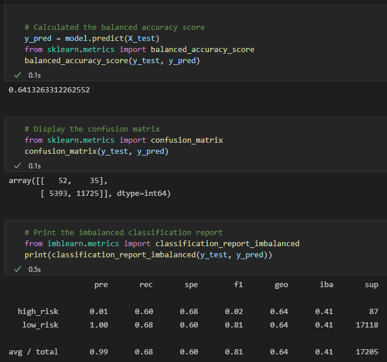

The results for this model shows a balanced accuracy score of 64%. For the high_risk, precision (pre) is 1% with sensitivity (rec) at 60%.  The calculated F1 score is only 2% for this model. For the low_risk group the precision is at 100% with the sensitivity at 68% and an F1 score of 81%.

For the overall testing the precision is 99%, sensitivity is 68% and the F1 Score is 81%.

- **SMOTE Oversampling Model**
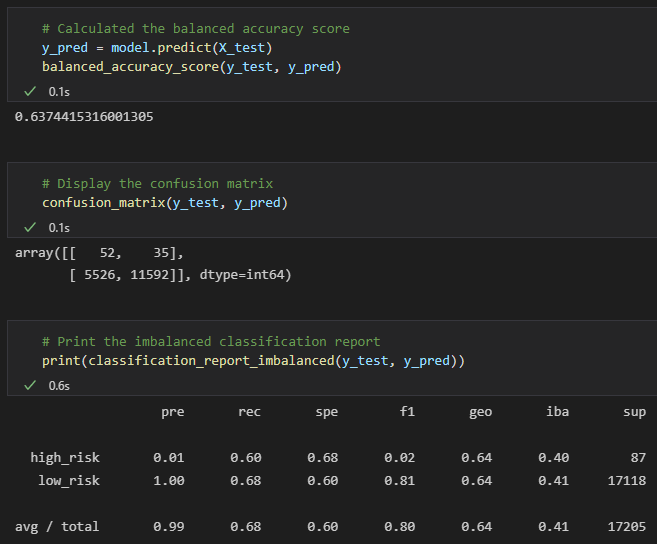

The balanced accuracy score for this model remained at 64%. For the high_risk, precision at 1% and the sensitivity at 60% with the F1 score at 2%. For the low_risk group the precision is at 100% with the sensitivity a 68% and the F1 score at 81%. There is no change in the metrics as compared to the Naive ROS Model.

For the overall testing the precision is 99%, sensitivity is 68% and the F1 Score is 80%.

- **Cluster Centroid Undersampling Model**
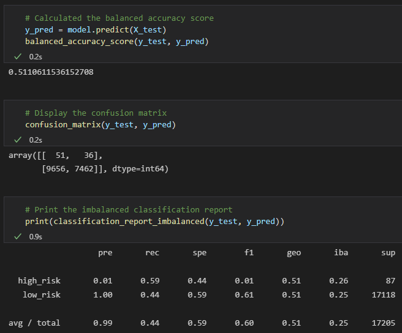

This model does an under -smapling to reduce the imbalance there with. The balanced accuracy score for this model came in at 51%. Within the high_risk group, the precision was 1%, the sensitivity at 59% and the F1 score at 1%. For the low_risk group the metrics were; precision at 100%, sensitivity at 44% and the F1 score at 61%.

For the overall testing the precision is 99%, sensitivity is 44% and the F1 Score is 60%.

- **SMOTEENN Model**
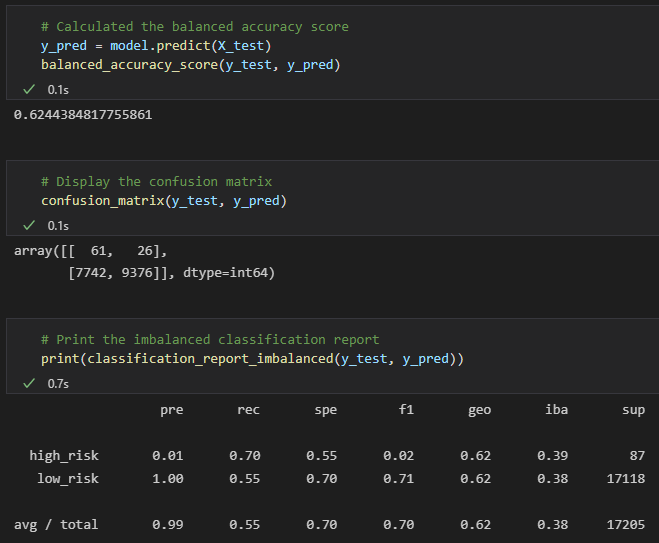
Again, the balance accuracy score for this model came in at 62%. The precision for the high_risk group was at 1% and the sensitivity for the same group was up to 70% with an F1 score of 2%. The low_risk group came in with a precision of 100% with the sensitivity at 55% with an F1 score of 71%.

For the overall testing the precision is 99%, sensitivity is 55% and the F1 Score is 70%.

- **Balanced Random Forest Classifier Model**
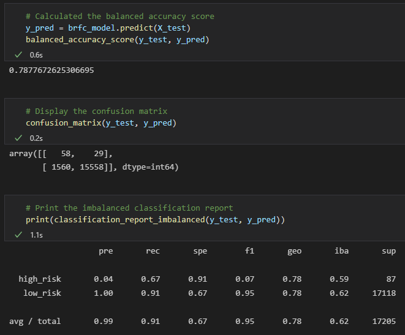

The balanced accuracy score for this method came in at 79% with high_risk precision at 4%, sensitivity at 67%, and F1 score at 7%. And for the low_risk group the precision was at 100%, sensitivity at 91% and F1 score at 67%.

For the overall testing the precision is 99%, sensitivity is 91% and the F1 Score is 95%.

- **Easy Ensemble Classifier Model**
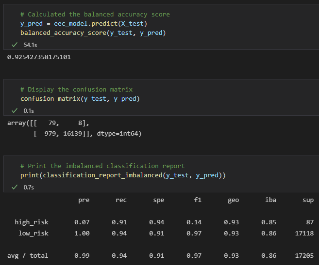

It is noted that the numbers for this model came in higher that all the other models in this analysis. The balance accuracy score was at 92% and for the high_risk group the precision was at 7%, sensitivity at 91% and the F1 score at 14%. And for the low_risk group the metrics were precision at 100%, sensitivity at 94% and the F1 score at 97%.

For the overall testing the precision is 99%, sensitivity is 94% and the F1 Score is 97%.

## Summary
The summary table below shows the metrics for all six models that were used in the analysis.
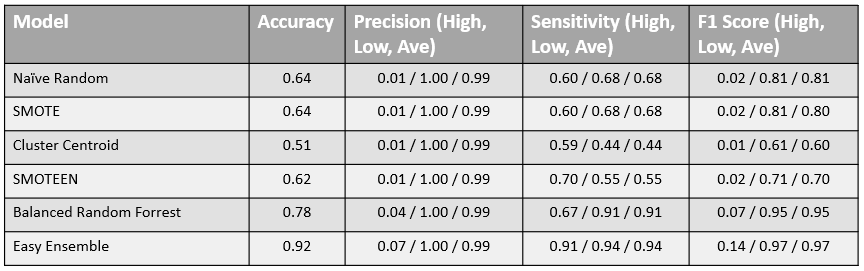

The metrics that are considered within the results are Accuracy, Precision. Sensitivity (or Recall), and the F1 Score.

For all calculations TP = True Positives, TN = True Negatives, FP = False Positives, and FN = False Negatives.

**Accuracy:** Accuracy is measured as the percentage of correct prediction. The equation for the calculation is shown below.

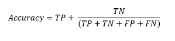

**Precision:** Precision is a measure of the percentage of positive prediction that are correct. It is also a measure of how reliable a positive classification is.

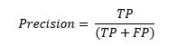

**Sensitivity:** Sensitivity (or Recall) measures the percentage of actual positive results that are correctly predicted as positive and is the true positive rate of the predictions. It van also be represented as how many observations with positive condition will be correctly diagnosed.

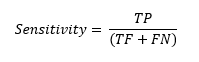

**F1 Score:** This is a balance score that is given taking into consideration both the Precision and Sensitivity.

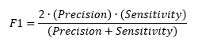

## Conclusion
The data show that the highest accuracy is fund in the Easy Ensemble Classifier model. This is a very good indicator if the samples are balanced. Since our sample are imbalanced, we need to take a look at a metric that takes into account both Precision and Sensitivity. In this case we will look at the F1 Score as an indicator to determine which classifier is best for the analysis population.

When looking at the F1 Score, the data also points at the Easy Ensemble Classifier as having the highest measure at 97%. This shows that even if the high risk and low risk populations are not equal in size, using the Easy Ensemble Classifier method for the analysis will yield the best outcome in identifying the high and low risk applicants.

It is my recommendation (as shown in the dataset) to use the Easy Ensemble Classifier as the analysis tool for the credit risk analysis.